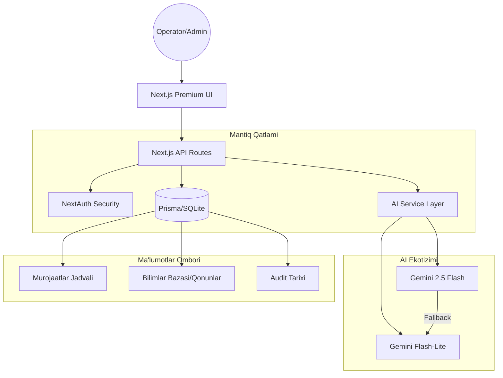

# AI Murojaat Tizimi: Architecture & Technical Stack

Ushbu hujjat sun'iy intellektga asoslangan "Murojaat Tizimi" platformasining yuqori darajadagi arxitekturasini tasvirlaydi.

## 🏛️ Tizim Arxitekturasi

Tizim zamonaviy agentik (AI-Agentic) yondashuv asosida qurilgan:

## 🛠️ Texnologik Stek

### Asosiy Freymvork
- **Next.js 16 (Turbopack)**: Platformaning asosi bo'lib, Server-Side Rendering (SSR) va Client-Side interaktivlikni ta'minlaydi.
- **TypeScript**: Barcha kodlarning tur xavfsizligini ta'minlaydi.

### Dizayn va UI
- **Vanilla CSS + Variables**: Premium ko'rinish va o'zgaruvchan mavzular uchun maxsus ishlab chiqilgan dizayn tizimi.
- **Lucide Icons**: Zamonaviy interfeys uchun yuqori sifatli SVG ikonkalar.

### Ma'lumotlar Bazasi
- **Prisma ORM**: Node.js uchun zamonaviy ma'lumotlar bazasi interfeysi.
- **SQLite**: Yengil, faylga asoslangan ma'lumotlar bazasi (PostgreSQL/MySQL ga oson migratsiya qilinishi mumkin).

### AI va LLM Integratsiyasi
- **Google Gemini API**: Matn tahlili, klassifikatsiya va rasmiy javob matnlarini yaratish uchun ishlatiladi.
- **Model Rotation Logic**: 429 (Rate Limit) xatolarini chetlab o'tish uchun bir nechta Gemini modellari o'rtasida avtomatik o'tish tizimi.

## 🔄 Asosiy Ish Jarayonlari (Workflows)

### 1. Murojaatni Qayta Ishlash
1. **Qabul qilish**: Email yoki qo'lda kiritilgan murojaat.
2. **AI Klassifikatsiya**: Mavzu, shoshilinchlik va tashkilot turini (Soliq, Prokuratura, MB) avtomatik aniqlash.
3. **Javob Loyihasi**: AI murojaat va bilimlar bazasidagi qonunlar asosida rasmiy javob matnini yaratadi.
4. **Compliance Tekshiruvi**: O'zbekiston bank qonunchiligiga muvofiqlikni avtomatik nazorat qilish.
5. **Review**: Operator loyihani tahrirlaydi yoki tasdiqlaydi.
6. **Yuborish**: Javob yuboriladi va audit tarixiga yoziladi.

### 2. Bilimlar Bazasi bilan Ishlash
- Admin yangi qonun matnini kiritadi.
- AI avtomatik ravishda hujjatni o'qib, xulosa chiqaradi.
- Tizim ushbu ma'lumotlarni kelajakdagi javoblar uchun o'z xotirasida saqlaydi.

---
*Ushbu tizim yuqori unumdorlikka ega ma'muriy muhit uchun ishlab chiqilgan.*
